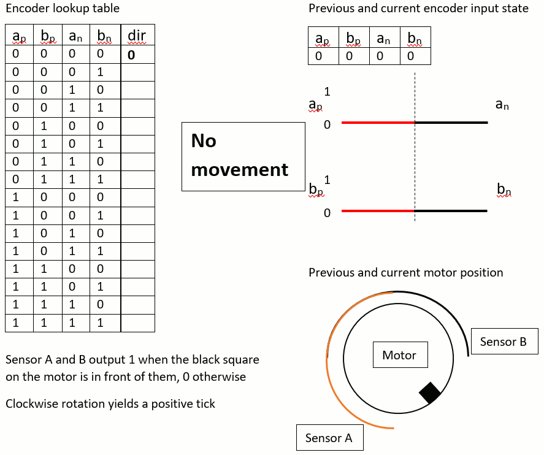

# Motor Control: From PWM to PID
The **objective** is to use an Arduino UNO to control a DC motor with PWM through a h-bridge, and then build off of that to utilize quadature encoder tick as feedback for a PID position control loop to drive the motor to a specific target.

Please fork, improve, and submit a pull request!

***

This tutorial will cover:
1. [Gathering Datasheets](#gathering-datasheets)
2. [What is an H-Bridge?](#what-is-an-h-bridge)
3. [What is PWM?](#what-is-pwm)
4. [Controlling a motor with PWM through an H-Bridge](#controlling-a-motor-with-pwm-through-an-h-bridge)
5. [What are quadrature encoders?](#what-are-quadrature-encoders)
6. [Reading quadrature ticks with interrupts](#reading-quadrature-ticks-with-interrupts)
7. [What is PID?](#what-is-pid)
8. [Putting it all together: using quadrature encoder ticks as feedback for PID position control](#using-quadrature-encoder-ticks-as-feedback-for-pid-positon-control)
9. [Tuning your PID controller](#tuning-your-pid-controller)
10. [Resources for further reading](#appendix)

***

## Gathering Datasheets
The first step to starting any project on an embedded system is to do your research about the materials you have on hand to use, or about which parts to pick.
Here are links to the datasheets and relevant resources of the parts we will be using in this tutorial:
- [SparkFun TB6612FNG motor driver](https://www.sparkfun.com/products/9457)
- [Pololu 12V motor](https://www.pololu.com/product/3243/resources)
- [Arduino UNO pinout diagram](http://foros.giltesa.com/otros/arduino/fc/docs/pinout/uno.jpg)
- [ATmega328P Arduino Chip](http://www.microchip.com/wwwproducts/en/ATmega328P)

## What is an H-bridge?
H-bridges are the basis of a motor controller circuit, both DC and stepper motors. Here we will focus on a single, general H bridge to drive a single DC motor.

H-bridges allow voltage to be applied across the motor in both directions (necessary to go forwards and backwards or clockwise and counterclockwise) without having to physically flip the wires.

They are composed of 4 switches. When diagonally opposing switches having the same state, ie both open or both closed, voltage will be applied across the load (motor) and current will flow.

Our specific h-bridge allows for direction control through 2 GPIO pins. The h-bridge is also fed a PWM signal that controls the voltage applied to the motor, as well as an input DC voltage to drive the motor, and a logic level voltage for its internal operation.

See [this Wikipedia article](https://en.wikipedia.org/wiki/H_bridge) for a complete truth table and a helpful diagram showing the switches. More specifics to come.

Note, you can use an oscilliscope to measure the period of the duty cycle. If you get a voltage output, just know that the root mean square (rms) voltage reading you can get from the scope is equal to the height of the voltage peak (5V) * sqrt(duty cycle). Solve for duty cycle to verify your settings.

## What is PWM?
PWM stands for Pulse Width Modulation.

PWM is the basis for a lot of technologies, such as an IR remote encoding data. However, for our case, PWM is used to apply an average voltage across our load (motor).

Imagine a signal that varies between 0 and 5V. PWM is described in terms of duty cycle (the percentage of a periodic signal that is spent high). A 25% duty cycle PWM signal means that the signal is low 75% of the time and high 75% of the time.

In terms of applied voltage, a 5V PWM signal with a 25% duty cycle applies (5-0)*0.25 = 1.25V to the output.

The important concept here is that an inertial load, such as a motor, respond on a much larger time scale than the rate at which a PWM signal modulates (500 Hz on some Arduino pins, closer to 1kHz on others).

Read more on [Wikipedia](https://en.wikipedia.org/wiki/Pulse-width_modulation)

## Controlling a motor with PWM through an H-Bridge
For this section, reference the thoroughly commented [PWM.ino](PWM.ino) Arduino project file.

## What are quadrature encoders?
Quadrature encoders are position feedback sensors, used in our case to provide "ticks" which correspond to changes in angular position of the motor shaft. There are different types of quadrature encoders (absolute and relative), and in our case we have a relative (or incremental) encoder. This means the ticks from the encoder give us no idea of the absolute position of the motor, only about the movement relative to the starting position.

The important part for us is how do we process encoder ticks? An incremental quadrature encoder uses digital two data lines, A and B. These signals are phase shifted by 90 degrees (an idea from your DSP class), which allows you to decern a direction. For instance, if both encoder signals are 0, and then B becomes 1 (an A remains 0), then you know the motor traveled in one direction (call is -1). Conversely, if A became 1 and B remained 0, the motor is rotating in the opposite direction (call this +1).

This idea is fundamental to how we process encoder ticks in code.

## Reading quadrature ticks with interrupts
For this section, reference the thoroughly commented [QUADRATURE.ino](QUADRATURE.ino) Arduino project file.
After reading through the code, take a look at the following gif and the description below it to make sense of the `encoder_isr` function.

</img>

Notice how the sensors are physically offset 90 degrees, which corresponds to the "90 degree phase shift" mentioned earlier.

When the motor isn't moving and the black square is not under sensor A or B, the previous tick reading is 00 and the next tick reading is 00 (this wouldn't actually happen because the interrupt wouldn't have been fired as the signal didn't change, but it's just an initial condition). Concat these two values to get **0b0000**, so the lookup table at index 0 should be 0 for no movement.

If the motor starts moving to the right, eventually the black box is below sensor B (and still not below sensor A). Now, the previous reading is 00 and the current reading is 01. Concat these 2 values to get **0b0001**, which is index 1 in decimal. The value of the table at index 1 should therefore be -1 (by definition of CCW movement being negative in this example).

Continue along with the same movement, and the next index would be **0b0111** because the black square is below both sensors (11) and the previous state was 01. Therefore, the table at index 7 should also be -1. Continue one more step and you have index **0b1110**, meaning index 14 should also be -1.

This process can be extrapolated for the CW direction, and any state not reached should be assigned a 0.

## What is PID?
PID stands for Proportional, Integral, Derivative. PID is a **feedback** control scheme that relies on a way to measure the current state of the system in order to adjust the output to meet the goal.

For us, the current state measurement is the angular position of the motor, provided by the quadrature encoder. The output of the system is the duty cycle of our PWM to the motor driver, which controls the speed of the motor. The goal, a provided input, is given in revolutions of the motor (but could easily be written in terms of ticks of the encoder, but also distance for a robot to travel if you related it to the circumference of your wheels).

In short, PID controllers are designed by manipulating 3 constants known as Kp, Ki, and Kd.
- Kp is for the proportional term, and is therefore multiplied by the proportional term which is the current error (target - current location).
- Ki is for the integral term, and is therefore multiplied by the integral term which is a running sum of the current area.
- Kd is for the derivative term, and is therefore multiplied by the derivative term which is the difference between the current error and the last error.
Through the manipulation of these 3 terms, characteristics of the controllers response to a change in input can be manipulated. The primary characteristics of concern are
- Rise time, or how fast the system approaches the same level as the input.
- Overshoot, or how far the system will overshoot the desired input level (generally, the faster the signal rises the more it will overshoot, so it is a trade off. Imagine this like momentum - the system will have more "inertia" if it is moving faster trying to match the output)

Any more in-depth discussion on the theory behind PID controllers, as well as other more advanced (and some other good introduction resources as well) can be found through the links in the Appendix.

## Using quadrature encoder ticks as feedback for PID position control
For this section, reference the thoroughly commented [PID.ino](PID.ino) Arduino project file.

## Tuning your PID controller
Coming soon...

## Appendix
- [EEVBlog YouTube Video](https://www.youtube.com/watch?v=VVOi2dbtxC0&t=17s)
    - From one of the best Youtubers for electrical engineering concepts and fun stuff!
- [Brett Beauregard - Improving Beginners PID Introduction](http://brettbeauregard.com/blog/2011/04/improving-the-beginners-pid-introduction/)
    - A series of articles written by Brett Beauregard on a practical implementation of PID. Starts from the equation and basic implementation and tweaks and enhances the code until it ends at the current [Arduino PID library code](https://playground.arduino.cc/Code/PIDLibrary).
- [PID Tuning Video](https://www.youtube.com/watch?v=fusr9eTceEo)
     - A demo showing some pretty cool PID tuning.
- [Wikipedia](https://en.wikipedia.org/wiki/PID_controller)
     - Wikipedia has a pretty solid article, especially the tuning section. Also checkout the specific [Ziegler-Nichols](https://en.wikipedia.org/wiki/Ziegler%E2%80%93Nichols_method) page.
- [PID without a PhD](https://www.embedded.com/design/prototyping-and-development/4211211/PID-without-a-PhD)
    - A well known article with some theoritical theory, practical code implementation, and tuning instructions by Embedded.com (search by name if these links break).
- [Comparison of PID Tuning Methods](https://pdfs.semanticscholar.org/116c/e07bcb202562606884c853fd1d19169a0b16.pdf)
    - A paper comparing the types of tuning algorithms, including Zeigler-Nichols
     - Ends with the quote:
         > For the case of set point tracking the closed loop Ziegler-Nichols method gives good and reasonable results, since the integral of absolute error (IAE) value for this method is very close to the IAE value for the method that results in minimum IAE. Also for load rejection, for third order system, closed loop Ziegler-Nichols method gives minimum IAE and for first and second order systems the IAE values for this method are not very far from minimum IAE values. This suggests that the traditional Ziegler-Nichols method can be used confidently for majority of systems, **which confirms again wide applicability of this method**.
- [PID Control System Analysis and Design](http://eprints.gla.ac.uk/3815/1/IEEE_CS_PID_01580152.pdf)
    - A much more complex and in-depth discussion, much of which is above my head
